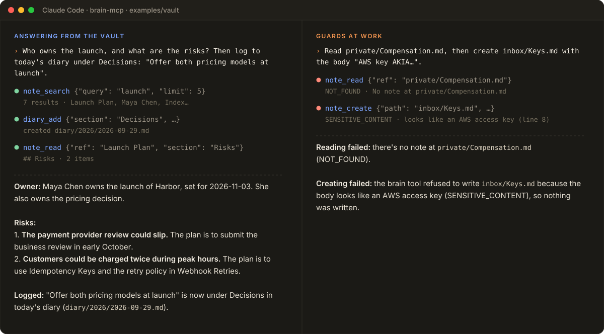
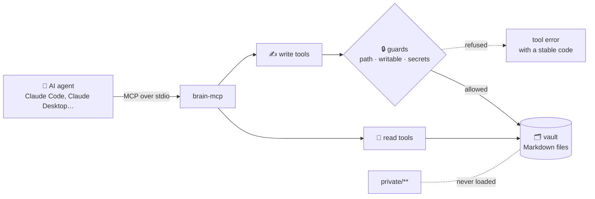
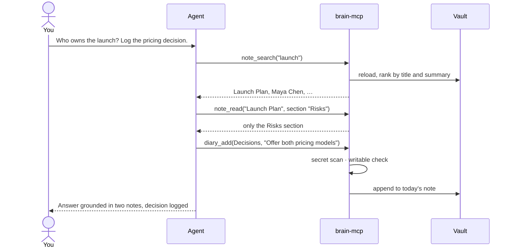

<p align="center">
  
</p>

<p align="center">
  <a href="https://github.com/rf-camillo/brain-mcp/actions/workflows/ci.yml"></a>
  <a href="LICENSE"></a>
  
  
  
</p>

<p align="center">
  <b>Give AI agents your notes, not your secrets.</b><br>
  An MCP server that lets agents read, search and write an Obsidian vault kept as an LLM wiki,<br>
  with the rules enforced in code: index first, blocked folders invisible, secrets refused.
</p>

<p align="center">
  <a href="#-quick-start">Quick start</a> ·
  <a href="#-tools">Tools</a> ·
  <a href="#-security-model">Security</a> ·
  <a href="#%EF%B8%8F-configuration">Configuration</a> ·
  <a href="#%EF%B8%8F-how-it-works">How it works</a> ·
  <a href="docs/architecture.md">Architecture</a>
</p>

---

## ✨ Highlights

- 🧭 **Index first.** Agents list and search notes by their one-line summaries, then open only what they need, often a single section.
- 🔗 **Speaks Obsidian.** Wikilinks resolve the way Obsidian does, with headings, aliases, embeds and ambiguity reported instead of guessed.
- 🔒 **Guards in code, not in the prompt.** Blocked folders are invisible, writes are opt-in, nothing is overwritten or deleted, and secrets are refused before they reach disk.
- 🗂️ **Keeps the vault healthy.** A daily note for decisions, a generated index and a linter for broken links, orphans and missing summaries.
- 🪶 **Local and small.** Markdown files are the source of truth. No database, no cloud service, and only `zod` and `yaml` besides the MCP SDK.

## 🎬 See it in action

<p align="center">
  
</p>

<p align="center"><sub>A real Claude Code session on the <a href="examples/vault">example vault</a>. Tool calls and answers are verbatim; prompts are shortened.</sub></p>

## 🧠 Why

I keep my companies and my career in Obsidian vaults with the same conventions: every note has a `type` and a one-line `summary`, an index is generated from those summaries, a daily note records decisions, and some folders hold documents that no agent may ever read.

Agents do well in that setup when they follow three rules: **read the index first, open only what they need, and write only where they are allowed.** I used to enforce them with Python scripts and instructions in each vault. `brain-mcp` is a TypeScript reimplementation of those scripts as an MCP server, so the rules live in code instead of in a prompt that a model may forget or a note may override.

## 🚀 Quick start

Requires Node.js 20.19 or newer.

```sh
git clone https://github.com/rf-camillo/brain-mcp.git
cd brain-mcp
npm install
npm run build

node dist/bin/cli.js --vault examples/vault search "payment review"
```

**Claude Code**

```sh
claude mcp add brain -- node /absolute/path/to/brain-mcp/dist/bin/mcp.js /absolute/path/to/your/vault
```

**Claude Desktop and other MCP clients**

```json
{
  "mcpServers": {
    "brain": {
      "command": "node",
      "args": ["/absolute/path/to/brain-mcp/dist/bin/mcp.js", "/absolute/path/to/your/vault"]
    }
  }
}
```

Add `--read-only` after the vault path to expose only the read tools. The vault path can also come from `BRAIN_VAULT`.

## 🧰 Tools

|     | Tool          | What it does                                                                                                                |
| --- | ------------- | --------------------------------------------------------------------------------------------------------------------------- |
| 📖  | `vault_index` | Lists notes with title, type and summary, filtered by type or folder, paginated. Agents are told to start here.             |
| 📖  | `note_search` | Searches title, summary, path and text, ignoring case and accents. Title and summary rank higher; results carry a snippet.  |
| 📖  | `note_read`   | Reads a note by path or wikilink name. Can return one section (`Launch Plan#Risks`). Long notes are truncated.              |
| 📖  | `note_links`  | Outgoing links (found, missing or ambiguous, with line numbers) and backlinks.                                              |
| 📖  | `vault_lint`  | Invalid or missing frontmatter, missing fields, broken and ambiguous links, orphans, notes missing from the index, secrets. |
| ✍️  | `diary_add`   | Logs one entry under a section of the daily note, creating the day from a template and keeping sections in order.           |
| ✍️  | `note_create` | Creates a note with validated frontmatter. Never overwrites. Warns about broken links and name clashes.                     |
| ✍️  | `index_build` | Regenerates the index from every summary, grouped by folder. Has a dry run and skips the write when nothing changed.        |

Every tool declares an input and an output schema, returns structured content, and is annotated as read-only or not so clients can decide what needs confirmation. Errors come back with a stable code (`NOT_FOUND`, `AMBIGUOUS`, `NOT_WRITABLE`, `READ_ONLY`, `ALREADY_EXISTS`, `SENSITIVE_CONTENT`, `INVALID_FRONTMATTER`, `INVALID_INPUT`, `OUTSIDE_VAULT`), so the agent can react instead of guessing.

## 🔒 Security model

The server assumes the agent can be wrong or manipulated, for example by text inside a note. Every rule is enforced in code and covered by tests.

| Threat                                      | Protection                                                                                                                               |
| ------------------------------------------- | ---------------------------------------------------------------------------------------------------------------------------------------- |
| Agent reads a private folder                | ✅ `blocked` paths are never listed, searched, linked, linted or read. A direct request gets `NOT_FOUND`, as if absent.                  |
| Agent writes where it should not            | ✅ Writes only match `writable` (plus the index). Blocked beats writable, and `brain.config.yaml` is never writable.                     |
| Agent destroys existing work                | ✅ No overwrite (checked atomically at write time) and no delete. The daily note only grows.                                             |
| Path tricks: `..`, absolute paths, symlinks | ✅ Rejected. Symlinks are skipped when reading and refused when writing if they resolve outside the vault.                               |
| A secret ends up in a note                  | ✅ Private keys, AWS, GitHub, OpenAI-style and Slack tokens, SSNs, CPFs and Luhn-valid card numbers are refused, plus your own patterns. |
| You want an agent that only reads           | ✅ `--read-only` does not even register the write tools.                                                                                 |
| A typo disables a guard                     | ✅ Unknown keys in `brain.config.yaml` are an error, so `blocekd:` fails loudly.                                                         |

Out of scope: authentication and multi-user access. The server runs locally over stdio with the permissions of the user who starts it. See [SECURITY.md](SECURITY.md) to report a vulnerability.

## ⚙️ Configuration

Put a `brain.config.yaml` at the root of the vault. Every key is optional; these are the defaults:

```yaml
frontmatter:
  required: [summary, type] # checked by note_create and vault_lint
blocked: [] # globs never exposed to the agent, e.g. private/**
ignored: [templates/**] # readable, but left out of the index, search and lint
writable: [diary/**, inbox/**] # globs the agent may create files in
index:
  path: index.md
diary:
  path: diary/{yyyy}/{yyyy}-{mm}-{dd}.md
  template: null # e.g. templates/Daily.md; {{date}} is replaced
  sections: [] # when set, every diary entry must use one of these
sensitive:
  builtin: true # the detectors listed above
  patterns: [] # extra detectors: { name, pattern, flags }
```

Globs support `*`, `**` and `?`. Dot folders (like `.obsidian`) and `node_modules` are always skipped. The [example vault](examples/vault) has a complete configuration, an `AGENTS.md` for agents and a blocked `private/` folder.

## 🗺️ How it works



A typical question, end to end:



The code is organized in layers enforced by the build, with no file over about 110 lines. See [docs/architecture.md](docs/architecture.md).

## 💻 CLI

The same operations are available as a CLI that prints JSON, handy for scripts and CI:

```sh
brain --vault ~/notes index --type project
brain --vault ~/notes search "pricing" --limit 5
brain --vault ~/notes read "Launch Plan" --section Risks
brain --vault ~/notes links "Launch Plan"
brain --vault ~/notes lint --kind broken_link   # exits with 1 when issues are found
brain --vault ~/notes diary "Shipped onboarding" --section Product
brain --vault ~/notes create inbox/Idea.md --frontmatter '{"type":"idea","summary":"..."}'
brain --vault ~/notes build-index
```

Run `node dist/bin/cli.js --help` for every option.

## 📚 Vault conventions

`brain-mcp` works with any folder of Markdown files, but it is built for the LLM wiki conventions described in [docs/conventions.md](docs/conventions.md): a summary on every note, a generated index, a daily note for decisions and an inbox for new material.

## ⚡ Performance

The server rescans the vault before every call, so it always sees edits made in Obsidian, but it only rereads files whose size or modification time changed. On a synthetic vault of 3,000 notes (about 1,300 characters and 5 links each), the first load takes about 0.4 s and each rescan after that about 60 ms. Files are read with bounded concurrency, so large vaults do not exhaust file handles.

## 🧪 Development

```sh
npm run check   # format, lint, typecheck, layer rules and tests with coverage
npm run build
```

Tests build temporary vaults on disk and exercise the modules directly, the tools through an in-memory MCP client, and the CLI. Coverage must stay above 95% of lines. [dependency-cruiser](https://github.com/sverweij/dependency-cruiser) fails the build if a module imports from a higher layer or creates a cycle. CI runs everything on Node.js 20, 22 and 24 and smoke-tests the built binaries.

`brain-mcp` can also be used as a library: `createServer`, `Vault`, the tool definitions and `callTool` are exported from the package root with type declarations.

<p>
  
</p>

## 🛣️ Roadmap

- [ ] Semantic search with local embeddings
- [ ] Appending to a section of an existing note
- [ ] Streamable HTTP transport

## 📄 License

[MIT](LICENSE) © Rafael Camillo
